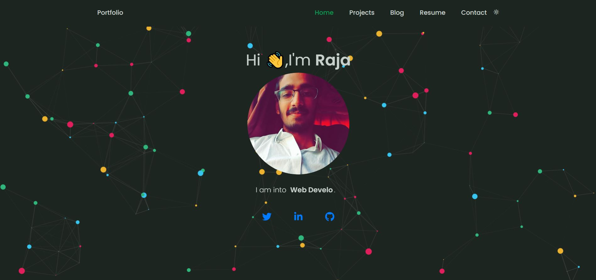
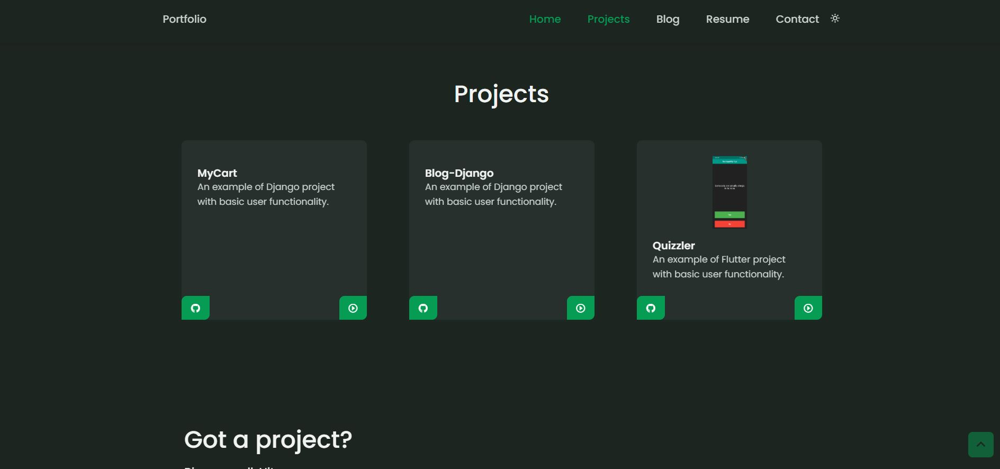
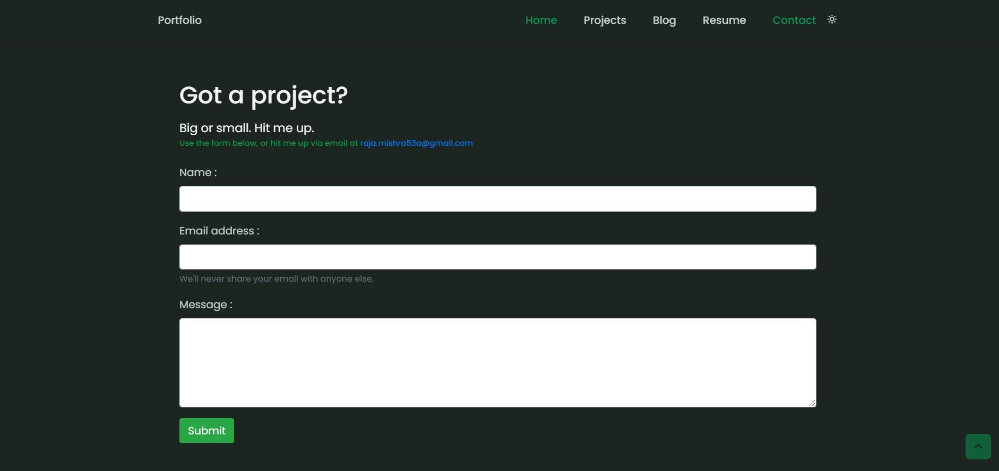
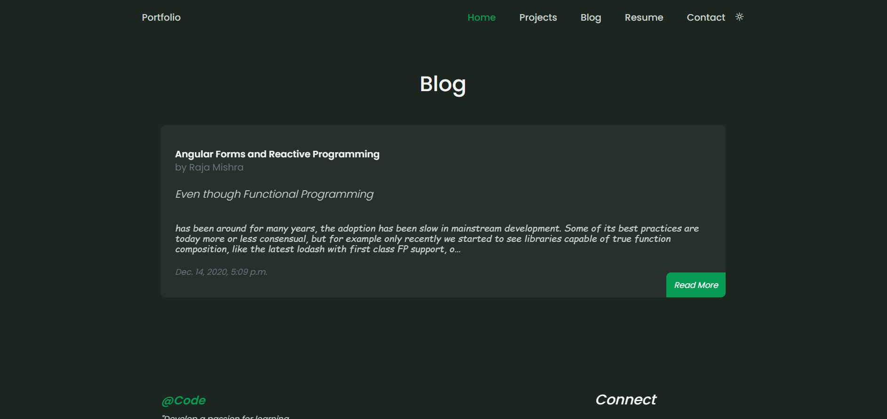
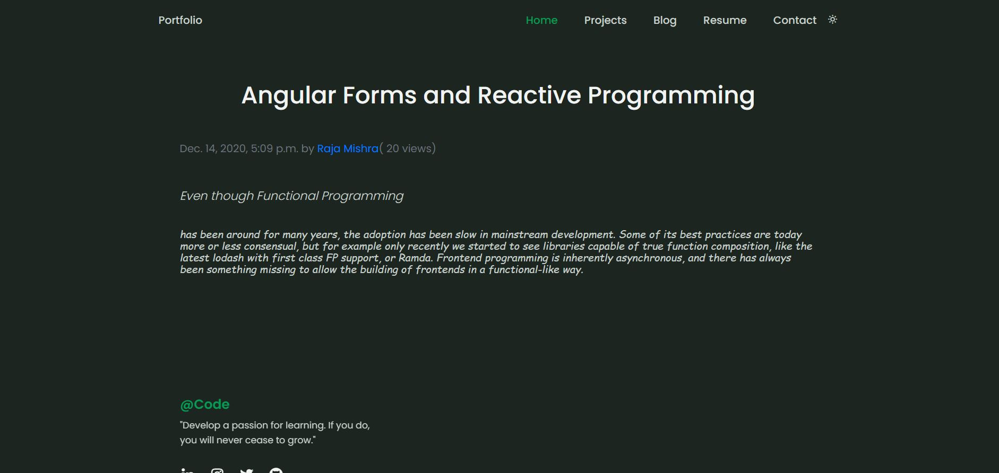
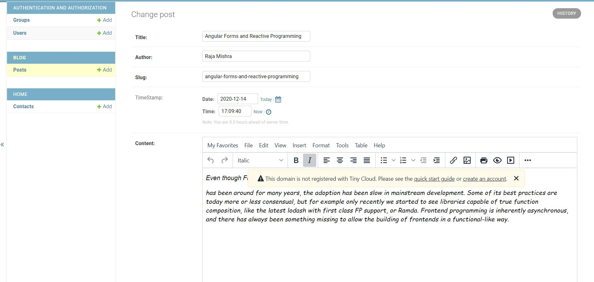
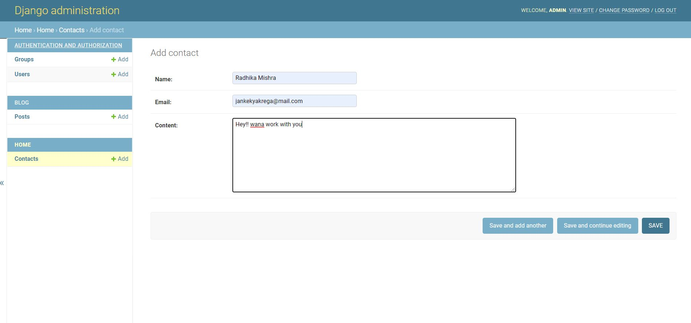

A Portfolio + Blog Web application using Django

## [Live](https://django-portf0lio.herokuapp.com/)

## Screenshots
   
  
 

## Functionality
- Pages
    - Home
    - Projects
    - Blog
    - Resume
    - Contact
 - Light/Dark Mode Toggle Button
 - Responsive Design with nice particles effect
 - Contact forum 
 - Blog Page
    - Automatic Blog Post and Display
    - Post View Counter
   

## Installing
   
### Clone the project

```
git clone https://github.com/raja53a/Portfolio-Django.git
cd Portfolio-Django
```

### Install dependencies & activate virtualenv

```
pip install pipenv

pip install -r requirements.txt

```

### Apply migrations

```
python manage.py makemigrations
python manage.py migrate
```
### Running

#### A development server

Run this command:

```
python manage.py runserver
```

